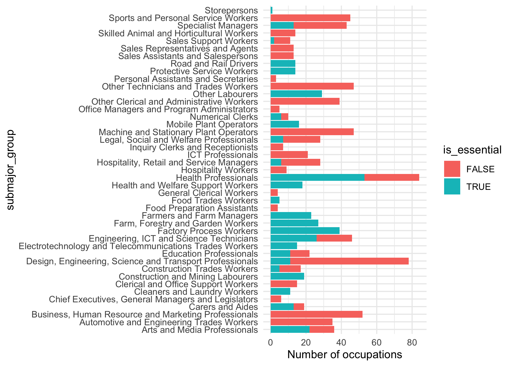

<!-- README.md is generated from README.Rmd. Please edit that file -->

# Australia’s Essential Workers

<!-- badges: start -->

<!-- badges: end -->

The goal of this repository is to identify essential workers by their
ANZSIC and ANZSCO codes. Pull requests are welcome. Note that, this is
by no means perfect.

# Data sources

The original data sources of the spreadsheets in ‘data’ folder are as
stated below.

  - ANZSIC:
    <https://www.fwc.gov.au/awards-and-agreements/minimum-wages-conditions/annual-wage-reviews/previous-wage-reviews/annual-wa-0>
  - ANZSCO:
    <https://www.abs.gov.au/AUSSTATS/abs@.nsf/DetailsPage/1220.02013,%20Version%201.3?OpenDocument>

# References

Sources of information I used to identify essential workers.

  - <https://www.theaustralian.com.au/world/coronavirus-the-essential-workers-wholl-keep-australia-ticking-along/news-story/cb7992b6ae722afd0838f17e61338e01>
  - <https://www.betterteam.com/what-is-an-essential-worker-in-australia>
  - <https://en.wikipedia.org/wiki/Essential_services>

# Process tables

<!-- ```{r, echo = FALSE} -->

<!-- # gt(head(anzsic_divisions, 10)) %>% -->

<!-- #   tab_header( -->

<!-- #     title = "ANZSIC 2006 divisions" -->

<!-- #   ) -->

<!-- kable(anzsic_divisions,  -->

<!--       caption = "ANZSIC 2006 divisions") -->

<!-- # gt(head(anzsic_codes, 10)) %>% -->

<!-- #   tab_header( -->

<!-- #     title = "ANZSIC 2006 codes", -->

<!-- #     subtitle = "first 10 rows only" -->

<!-- #   )  -->

<!-- kable(head(anzsic_codes, 10),  -->

<!--     caption = "ANZSIC 2006 codes, first 10 rows only") -->

<!--   # scroll_box(width = "500px", height = "200px") -->

<!-- ``` -->

<!-- ```{r, echo = FALSE} -->

<!-- kable(anzsoc_major,  -->

<!--     caption = "ANZSOC 2013 - Major group") -->

<!-- # gt(anzsoc_major) %>% -->

<!-- #   tab_header( -->

<!-- #     title = "ANZSOC 2013 - Major group" -->

<!-- #   ) -->

<!-- kable(head(anzsoc_submajor, 10),  -->

<!--     caption = "ANZSOC 2013 - Sub-major group, first 10 rows only") -->

<!-- # gt(head(anzsoc_submajor, 10)) %>% -->

<!-- #   tab_header( -->

<!-- #     title = "ANZSOC 2013 - Submajor group", -->

<!-- #     subtitle = "first 10 rows only" -->

<!-- #   ) -->

<!-- kable(head(anzsoc_minor, 10),  -->

<!--     caption = "ANZSOC 2013 - Minor group, first 10 rows only") -->

<!-- # gt(head(anzsoc_minor, 10)) %>% -->

<!-- #   tab_header( -->

<!-- #     title = "ANZSOC 2013 - Minor group", -->

<!-- #     subtitle = "first 10 rows only" -->

<!-- #   ) -->

<!-- kable(head(anzsoc_unit, 10),  -->

<!--     caption = "ANZSOC 2013 - Unit group, first 10 rows only") -->

<!-- # gt(head(anzsoc_unit, 10)) %>% -->

<!-- #   tab_header( -->

<!-- #     title = "ANZSOC 2013 - Unit group", -->

<!-- #     subtitle = "first 10 rows only" -->

<!-- #   ) -->

<!-- kable(head(anzsoc_unit, 10),  -->

<!--     caption = "ANZSOC 2013 - Occupation, first 10 rows only") -->

<!-- # gt(head(anzsoc_occupation, 10)) %>% -->

<!-- #   tab_header( -->

<!-- #     title = "ANZSOC 2013 - Occupation", -->

<!-- #     subtitle = "first 10 rows only" -->

<!-- #   ) -->

<!-- ``` -->

## ANZSIC

Merge ANZSIC tables together.
`data/processed-data/cleaned_anzsic_2006.csv`

<table>

<caption>

ANZSIC 2006 table

</caption>

<thead>

<tr>

<th style="text-align:left;">

anzsic\_division

</th>

<th style="text-align:left;">

anzsic\_code

</th>

<th style="text-align:left;">

anzsic\_class\_title

</th>

<th style="text-align:left;">

anzsic\_division\_title

</th>

</tr>

</thead>

<tbody>

<tr>

<td style="text-align:left;">

A

</td>

<td style="text-align:left;">

A0111

</td>

<td style="text-align:left;">

Nursery Production (Under Cover)

</td>

<td style="text-align:left;">

Agriculture, Forestry and Fishing

</td>

</tr>

<tr>

<td style="text-align:left;">

A

</td>

<td style="text-align:left;">

A0112

</td>

<td style="text-align:left;">

Nursery Production (Outdoors)

</td>

<td style="text-align:left;">

Agriculture, Forestry and Fishing

</td>

</tr>

<tr>

<td style="text-align:left;">

A

</td>

<td style="text-align:left;">

A0113

</td>

<td style="text-align:left;">

Turf Growing

</td>

<td style="text-align:left;">

Agriculture, Forestry and Fishing

</td>

</tr>

<tr>

<td style="text-align:left;">

A

</td>

<td style="text-align:left;">

A0114

</td>

<td style="text-align:left;">

Floriculture Production (Under Cover)

</td>

<td style="text-align:left;">

Agriculture, Forestry and Fishing

</td>

</tr>

<tr>

<td style="text-align:left;">

A

</td>

<td style="text-align:left;">

A0115

</td>

<td style="text-align:left;">

Floriculture Production (Outdoors)

</td>

<td style="text-align:left;">

Agriculture, Forestry and Fishing

</td>

</tr>

<tr>

<td style="text-align:left;">

A

</td>

<td style="text-align:left;">

A0121

</td>

<td style="text-align:left;">

Mushroom Growing

</td>

<td style="text-align:left;">

Agriculture, Forestry and Fishing

</td>

</tr>

<tr>

<td style="text-align:left;">

A

</td>

<td style="text-align:left;">

A0122

</td>

<td style="text-align:left;">

Vegetable Growing (Under Cover)

</td>

<td style="text-align:left;">

Agriculture, Forestry and Fishing

</td>

</tr>

<tr>

<td style="text-align:left;">

A

</td>

<td style="text-align:left;">

A0123

</td>

<td style="text-align:left;">

Vegetable Growing (Outdoors)

</td>

<td style="text-align:left;">

Agriculture, Forestry and Fishing

</td>

</tr>

<tr>

<td style="text-align:left;">

A

</td>

<td style="text-align:left;">

A0131

</td>

<td style="text-align:left;">

Grape Growing

</td>

<td style="text-align:left;">

Agriculture, Forestry and Fishing

</td>

</tr>

<tr>

<td style="text-align:left;">

A

</td>

<td style="text-align:left;">

A0132

</td>

<td style="text-align:left;">

Kiwifruit Growing

</td>

<td style="text-align:left;">

Agriculture, Forestry and Fishing

</td>

</tr>

</tbody>

</table>

<!-- ## Identify essential industries -->

<!-- ```{r} -->

<!-- essential_industries <-  -->

<!--   c("Agriculture, Forestry and Fishing",  -->

<!--     "Electricity, Gas, Water and Waste Services", -->

<!--     "Health Care and Social Assistance", -->

<!--     "Retail Trade", -->

<!--     "Accommodation and Food Services", -->

<!--     "Transport, Postal and Warehousing", -->

<!--     "Public Administration and Safety") -->

<!-- anzsic_codes %>% -->

<!--   .[, is_essential := FALSE] %>% -->

<!--   .[anzsic_division_title %in% essential_industries, is_essential := TRUE] -->

<!-- ``` -->

<!-- ```{r anzsic-plot} -->

<!-- ggplot(anzsic_codes, aes(y = anzsic_division_title, fill = is_essential)) + -->

<!--   geom_bar() + -->

<!--   theme_minimal() -->

<!-- ``` -->

## ANZSOC

Merge ANZSOC tables together. See in
`data/processed-data/cleaned_anzsoc_2013.csv`

<table>

<caption>

ANZSOC 2013 table

</caption>

<thead>

<tr>

<th style="text-align:left;">

major\_code

</th>

<th style="text-align:left;">

major\_group

</th>

<th style="text-align:left;">

submajor\_code

</th>

<th style="text-align:left;">

submajor\_group

</th>

<th style="text-align:left;">

minor\_code

</th>

<th style="text-align:left;">

minor\_group

</th>

<th style="text-align:left;">

unit\_code

</th>

<th style="text-align:left;">

unit\_group

</th>

<th style="text-align:left;">

occupation\_code

</th>

<th style="text-align:left;">

occupation\_group

</th>

<th style="text-align:left;">

skill\_level

</th>

</tr>

</thead>

<tbody>

<tr>

<td style="text-align:left;">

1

</td>

<td style="text-align:left;">

MANAGERS

</td>

<td style="text-align:left;">

11

</td>

<td style="text-align:left;">

Chief Executives, General Managers and Legislators

</td>

<td style="text-align:left;">

111

</td>

<td style="text-align:left;">

Chief Executives, General Managers and Legislators

</td>

<td style="text-align:left;">

1111

</td>

<td style="text-align:left;">

Chief Executives and Managing Directors

</td>

<td style="text-align:left;">

111111

</td>

<td style="text-align:left;">

Chief Executive or Managing Director

</td>

<td style="text-align:left;">

1

</td>

</tr>

<tr>

<td style="text-align:left;">

1

</td>

<td style="text-align:left;">

MANAGERS

</td>

<td style="text-align:left;">

11

</td>

<td style="text-align:left;">

Chief Executives, General Managers and Legislators

</td>

<td style="text-align:left;">

111

</td>

<td style="text-align:left;">

Chief Executives, General Managers and Legislators

</td>

<td style="text-align:left;">

1112

</td>

<td style="text-align:left;">

General Managers

</td>

<td style="text-align:left;">

111211

</td>

<td style="text-align:left;">

Corporate General Manager

</td>

<td style="text-align:left;">

1

</td>

</tr>

<tr>

<td style="text-align:left;">

1

</td>

<td style="text-align:left;">

MANAGERS

</td>

<td style="text-align:left;">

11

</td>

<td style="text-align:left;">

Chief Executives, General Managers and Legislators

</td>

<td style="text-align:left;">

111

</td>

<td style="text-align:left;">

Chief Executives, General Managers and Legislators

</td>

<td style="text-align:left;">

1112

</td>

<td style="text-align:left;">

General Managers

</td>

<td style="text-align:left;">

111212

</td>

<td style="text-align:left;">

Defence Force Senior Officer

</td>

<td style="text-align:left;">

1

</td>

</tr>

<tr>

<td style="text-align:left;">

1

</td>

<td style="text-align:left;">

MANAGERS

</td>

<td style="text-align:left;">

11

</td>

<td style="text-align:left;">

Chief Executives, General Managers and Legislators

</td>

<td style="text-align:left;">

111

</td>

<td style="text-align:left;">

Chief Executives, General Managers and Legislators

</td>

<td style="text-align:left;">

1113

</td>

<td style="text-align:left;">

Legislators

</td>

<td style="text-align:left;">

111311

</td>

<td style="text-align:left;">

Local Government Legislator

</td>

<td style="text-align:left;">

1

</td>

</tr>

<tr>

<td style="text-align:left;">

1

</td>

<td style="text-align:left;">

MANAGERS

</td>

<td style="text-align:left;">

11

</td>

<td style="text-align:left;">

Chief Executives, General Managers and Legislators

</td>

<td style="text-align:left;">

111

</td>

<td style="text-align:left;">

Chief Executives, General Managers and Legislators

</td>

<td style="text-align:left;">

1113

</td>

<td style="text-align:left;">

Legislators

</td>

<td style="text-align:left;">

111312

</td>

<td style="text-align:left;">

Member of Parliament

</td>

<td style="text-align:left;">

1

</td>

</tr>

<tr>

<td style="text-align:left;">

1

</td>

<td style="text-align:left;">

MANAGERS

</td>

<td style="text-align:left;">

11

</td>

<td style="text-align:left;">

Chief Executives, General Managers and Legislators

</td>

<td style="text-align:left;">

111

</td>

<td style="text-align:left;">

Chief Executives, General Managers and Legislators

</td>

<td style="text-align:left;">

1113

</td>

<td style="text-align:left;">

Legislators

</td>

<td style="text-align:left;">

111399

</td>

<td style="text-align:left;">

Legislators nec

</td>

<td style="text-align:left;">

1

</td>

</tr>

<tr>

<td style="text-align:left;">

1

</td>

<td style="text-align:left;">

MANAGERS

</td>

<td style="text-align:left;">

12

</td>

<td style="text-align:left;">

Farmers and Farm Managers

</td>

<td style="text-align:left;">

121

</td>

<td style="text-align:left;">

Farmers and Farm Managers

</td>

<td style="text-align:left;">

1211

</td>

<td style="text-align:left;">

Aquaculture Farmers

</td>

<td style="text-align:left;">

121111

</td>

<td style="text-align:left;">

Aquaculture Farmer

</td>

<td style="text-align:left;">

1

</td>

</tr>

<tr>

<td style="text-align:left;">

1

</td>

<td style="text-align:left;">

MANAGERS

</td>

<td style="text-align:left;">

12

</td>

<td style="text-align:left;">

Farmers and Farm Managers

</td>

<td style="text-align:left;">

121

</td>

<td style="text-align:left;">

Farmers and Farm Managers

</td>

<td style="text-align:left;">

1212

</td>

<td style="text-align:left;">

Crop Farmers

</td>

<td style="text-align:left;">

121211

</td>

<td style="text-align:left;">

Cotton Grower

</td>

<td style="text-align:left;">

1

</td>

</tr>

<tr>

<td style="text-align:left;">

1

</td>

<td style="text-align:left;">

MANAGERS

</td>

<td style="text-align:left;">

12

</td>

<td style="text-align:left;">

Farmers and Farm Managers

</td>

<td style="text-align:left;">

121

</td>

<td style="text-align:left;">

Farmers and Farm Managers

</td>

<td style="text-align:left;">

1212

</td>

<td style="text-align:left;">

Crop Farmers

</td>

<td style="text-align:left;">

121212

</td>

<td style="text-align:left;">

Flower Grower

</td>

<td style="text-align:left;">

1

</td>

</tr>

<tr>

<td style="text-align:left;">

1

</td>

<td style="text-align:left;">

MANAGERS

</td>

<td style="text-align:left;">

12

</td>

<td style="text-align:left;">

Farmers and Farm Managers

</td>

<td style="text-align:left;">

121

</td>

<td style="text-align:left;">

Farmers and Farm Managers

</td>

<td style="text-align:left;">

1212

</td>

<td style="text-align:left;">

Crop Farmers

</td>

<td style="text-align:left;">

121213

</td>

<td style="text-align:left;">

Fruit or Nut Grower

</td>

<td style="text-align:left;">

1

</td>

</tr>

</tbody>

</table>

## Identify essential workers


